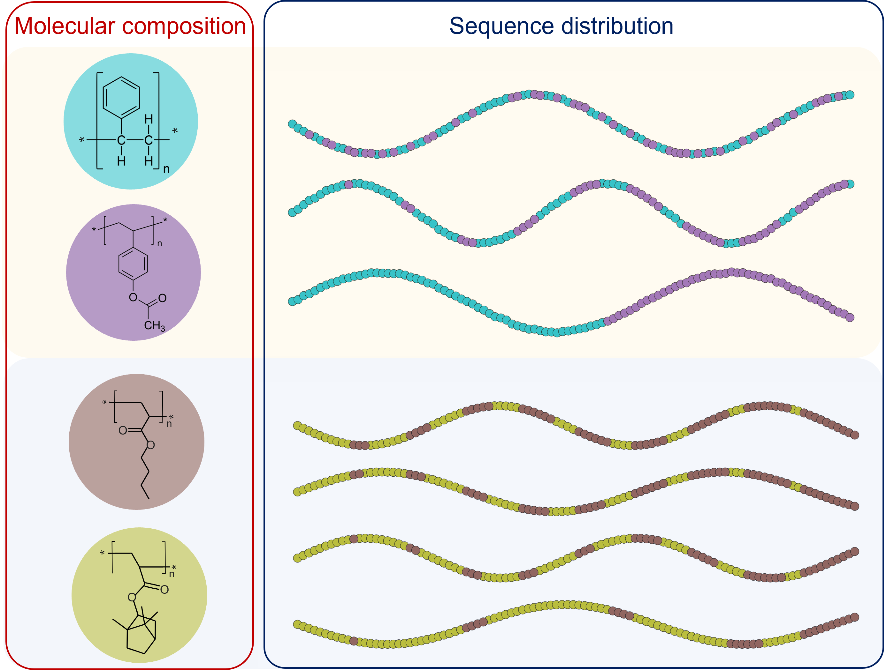

# Copolymer Machine Learning
A machine-learning (ML) implementation that incorporate the information of both **molecular composition** and **sequence distribution** of copolymers including **random, block, and gradientt** copolymers. Please refer to our work "Machine Learning Strategies for the Structure-Property Relationship of Copolymers" for additional details.



## General Use
Given the molecular composition (SMILES of monomers) and copolymer sequence type (random, block, gradient), the ML model can incorporate both information and establish the structure-property relationship.
1. Datasets used in this work are uploaded to the `/datasets` folder.
2. Train model on each dataset, for example:
```
python train_dataset1.py --model 'RNN'
```
model options are 'CNN', 'FFNN', 'RNN', 'Fusion'
